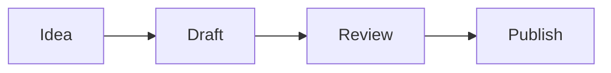

# 文件与媒体

Tolaria 以 Markdown 笔记为起点，但 vault 也可以包含图片、PDF、媒体文件、白板和其他本地文件。

## Mermaid 图表

当笔记需要保持纯文本且可版本控制的图表时，请使用 Mermaid 代码块。

````md

````

Tolaria 在编辑器中渲染 Mermaid 图表，同时将源码保留在 Markdown 中。

## 附件

粘贴到编辑器中的图片将作为普通文件保存到 vault 中。它们保持可移植性，并且可以被其他工具打开。

## 预览

Tolaria 可以在应用内预览常见的图片文件、PDF 和受支持的媒体文件。没有应用内预览功能的文件仍可在默认系统应用中打开。

设置项控制 PDF、图片和不受支持的文件是否显示在"所有笔记"中。文件夹浏览仍然会在其文件夹中显示这些文件。

## 白板

白板在编辑器中使用了 tldraw，但其持久化表示仍保留在 Markdown 中。这使得它们保持在 vault 内部，并与你的其余笔记一起被 Git 版本控制。

## Git 边界

如果生成的文件或仅本地文件被 Git 忽略，Tolaria 可以将其从笔记、搜索、快速打开和文件夹中隐藏。当构建产物或私有本地文件不应表现为 vault 内容时，可以使用此功能。
